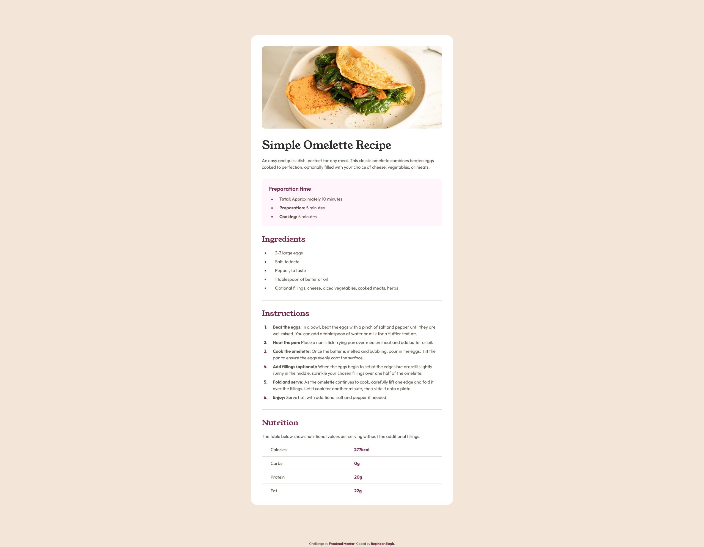

# Frontend Mentor - Recipe page solution

This is a solution to the [Recipe page challenge on Frontend Mentor](https://www.frontendmentor.io/challenges/recipe-page-KiTsR8QQKm). Frontend Mentor challenges help you improve your coding skills by building realistic projects. 

## Table of contents

- [Frontend Mentor - Recipe page solution](#frontend-mentor---recipe-page-solution)
  - [Table of contents](#table-of-contents)
  - [Overview](#overview)
    - [Screenshot](#screenshot)
    - [Links](#links)
  - [My process](#my-process)
    - [Built with](#built-with)
    - [What I learned](#what-i-learned)
  - [Author](#author)

## Overview

### Screenshot



### Links

<!-- - Solution URL: [Frontend Mentor](https://your-solution-url.com) -->
- Live Site URL: [GitHub pages](https://pellia.github.io/fm-recipe-page/)

## My process

### Built with

- Semantic HTML
- CSS | Grid | Flex | Custom Properties | Media Queries
- Mobile-first workflow
- Responsive Design

### What I learned

Used pseude-elements and pseudo classes to style the bullets or numbers of list items with a custom color and add consistent spacing between list items for cleaner visual layout.

```css
.recipe__preparation-list-item::marker {
  color: var(--color-rose-800);
}
```

```css
.recipe__preparation-list-item:not(:last-child) {
  margin-bottom: var(--space-100);
}
```

## Author

- Website - [Rupinder Singh](https://www.rupinder-singh.com/)
- Frontend Mentor - [@Pellia](https://www.frontendmentor.io/profile/Pellia)